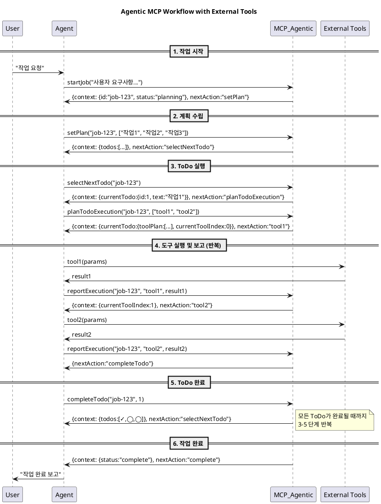

# MCP (Model Context Protocol) Tools를 활용한 확장성 높은 Agentic Workflow

- MCP Tools의 Chaining을 통해 다양한 Tool을 활용하여 복잡한 Task를 수행하도록 하기 위한 MCP Tool 기반 Framework 제공
- 범용적 Framework으로써 많은 Workflow를 수용할 수 있음

## Framework Concept

- Tool Call의 Parameter를 통해 각 단계의 필요한 정보의 생성을 강제화
- Job Context를 Tool 호출 시 항상 노출하여 맥락의 유지를 강화
- LLM 기반 Agent는 이 MCP 도구를 호출하면서 자연스럽게 복잡한 Task를 수행해나가게됨
- 각 단계는 다음단계가 명시적이며 다음에 어떤 도구를 호출해야 하는지 nextAction의 값으로 LLM 기반 Agent에 Return하게됨
- Return된 정보는 Tool Output으로 Message Context 내에 포함되게됨
- **핵심: Recursive Turn-Taking을 통해 Agent가 자율적으로 작업을 진행하도록 유도**

### Context Type

```ts
interface ToDo {
    id: number;
    text: string;
    check: boolean;
}

interface CurrentTodo {
    todoId: number;
    todoText: string;
    toolPlan: string[];        // 실행할 도구 순서
    currentToolIndex: number;   // 현재 실행 중인 도구 인덱스
}

interface ExecutionRecord {
    tool: string;
    result: any;
    timestamp: number;
}

interface JobContext {
    id: string;
    goal: string;
    status: 'planning' | 'executing' | 'complete';
    todos: ToDo[];
    currentTodo?: CurrentTodo;
    executionHistory: ExecutionRecord[];
    thoughts: string[];
}

interface JobResponse {
    context: JobContext;
    nextAction: string;  // Agent가 다음에 호출해야 할 function/tool
}
```

### MCP Tool Methods

```ts
// Job 시작
startJob(goal: string): JobResponse

// 계획 수립
setPlan(jobId: string, todos: string[]): JobResponse

// 다음 ToDo 선택
selectNextTodo(jobId: string): JobResponse

// ToDo 실행 계획 수립 (도구 시퀀스 정의)
planTodoExecution(jobId: string, tools: string[]): JobResponse

// 도구 실행 결과 보고
reportExecution(jobId: string, tool: string, result: any): JobResponse

// ToDo 완료 처리
completeTodo(jobId: string, todoId: number): JobResponse
```

### Workflow


<!-- 

-->

### 특징

1. **상태 기반 가이드**: MCP가 상태를 관리하고 nextAction으로 Agent를 가이드
2. **자율적 실행**: Agent는 MCP의 가이드를 따라 자율적으로 도구 호출 및 작업 수행
3. **투명한 추적**: 모든 도구 실행 결과가 executionHistory에 기록되어 추적 가능
4. **유연한 도구 통합**: 어떤 외부 도구든 toolPlan에 포함시켜 실행 가능

npx recursive-flow
npm install -g mcp-flow
git clone <your-repo>
## How to Use

### 1. Install

```bash
npm install -g recursive-flow
# 또는 npx로 바로 실행
npx recursive-flow
```

### 2. Claude Desktop 연동

Claude Desktop 설정 파일(`claude_desktop_config.json`)에 다음과 같이 등록하세요:

```json
{
  "mcpServers": {
    "recursive-flow": {
      "command": "npx",
      "args": ["recursive-flow"]
    }
  }
}
```

설치 후 Claude Desktop을 재시작하면 MCP 서버가 자동 연동됩니다.
