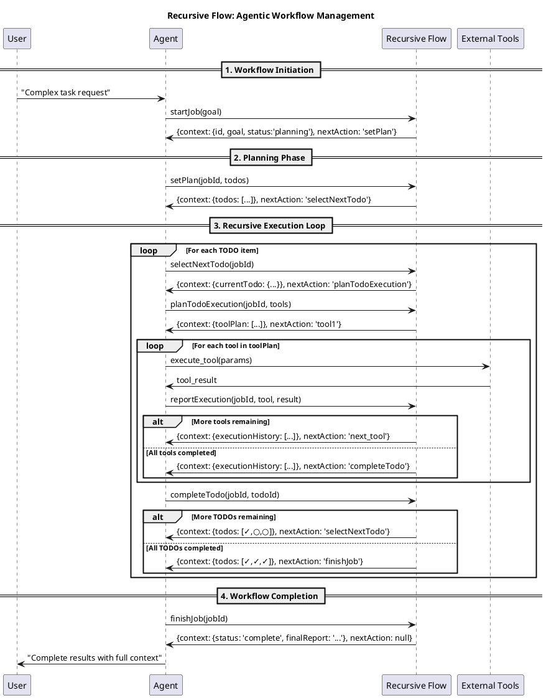

# Recursive Flow: AI Agent Workflow Manager

Recursive Flow is a powerful MCP (Model Context Protocol) server that enables AI agents to break down complex tasks into manageable steps and execute them systematically. Perfect for automating multi-step workflows with Claude Desktop and other MCP-compatible AI assistants.

## What It Does

- **Smart Task Breaking**: Automatically breaks down complex requests into smaller, manageable todo items
- **Guided Execution**: Provides step-by-step guidance to AI agents on what to do next
- **Tool Orchestration**: Coordinates multiple tools and services to complete complex workflows
- **Progress Tracking**: Keeps track of what's been done and what's still pending
- **Context Preservation**: Maintains full context throughout the entire workflow

## Key Benefits

- **Autonomous Operation**: AI agents can work independently without constant guidance
- **Reliable Execution**: Systematic approach ensures nothing gets missed
- **Flexible Integration**: Works with any MCP-compatible tools and services
- **Complete Transparency**: Full audit trail of all actions taken
- **Self-Managing**: Agents know exactly what to do next at each step

## How It Works

When you give your AI assistant a complex task, Recursive Flow helps it work through the task systematically:

1. **Planning Phase**: The AI breaks down your request into specific action items
2. **Execution Phase**: Each action item is tackled step-by-step with the right tools
3. **Progress Tracking**: The system keeps track of what's done and what's next
4. **Completion**: Once all items are finished, you get a complete summary

### Example Workflow

Let's say you ask your AI to "Research competitors and create a market analysis report":

1. **Planning**: The AI creates a plan with steps like:
   - Research main competitors
   - Analyze their pricing strategies
   - Compare product features
   - Create summary document

2. **Execution**: For each step, the AI:
   - Identifies the right tools to use (web search, data analysis, document creation)
   - Executes each tool in the right order
   - Records the results for the next step

3. **Completion**: You receive a comprehensive market analysis with all supporting research

### Recursive Flow Architecture

The following sequence diagram shows how the tools work together in a recursive, self-managing workflow:



### Key Architectural Features

- **Self-Directed**: Each tool returns `nextAction` to guide the agent
- **Context Accumulation**: `executionHistory` builds comprehensive knowledge
- **Variable Length**: Workflow adapts to any number of steps and tools
- **Recursive Pattern**: Core loop of select → plan → execute → complete
- **Clean Termination**: `nextAction: null` signals workflow completion

## What Makes It Special

- **No Manual Intervention**: Once started, the AI can complete complex multi-step tasks without you having to guide each step
- **Reliable Results**: The systematic approach ensures consistent, thorough completion of tasks
- **Full Visibility**: You can see exactly what was done and how decisions were made
- **Extensible**: Works with any tools your AI assistant has access to

## Installation & Setup

### Setting Up with Claude Desktop

To use Recursive Flow with Claude Desktop, add it to your MCP configuration:

1. **Locate your configuration file**: Find `claude_desktop_config.json` in your system:
   - **macOS**: `~/Library/Application Support/Claude/claude_desktop_config.json`
   - **Windows**: `%APPDATA%\Claude\claude_desktop_config.json`

2. **Add Recursive Flow** to your MCP servers:

```json
{
  "mcpServers": {
    "recursive-flow": {
      "command": "node",
      "args": ["/path/to/recursive-flow/src/index.ts"],
      "env": {}
    }
  }
}
```

3. **Restart Claude Desktop**

### Using with Other AI Assistants

Recursive Flow works with any AI assistant that supports the Model Context Protocol (MCP). Check your AI assistant's documentation for MCP server setup instructions.

## How to Use

Once installed, you can give your AI assistant complex tasks and it will automatically use Recursive Flow to manage the workflow. Here are some examples:

### Simple Usage
Just ask your AI assistant to handle complex tasks naturally:

> "I need you to research the top 5 competitors in the electric vehicle market and create a detailed comparison report"

### What Happens Behind the Scenes
1. **Job Creation**: The AI starts a new workflow job
2. **Planning**: Breaks down the task into specific steps
3. **Execution**: Works through each step systematically
4. **Completion**: Provides comprehensive results

### Example Tasks Perfect for Recursive Flow

- **Market Research**: "Research competitors and create analysis reports"
- **Content Creation**: "Plan and create a complete social media campaign"
- **Data Analysis**: "Analyze sales data and prepare executive presentations"
- **Project Planning**: "Create a detailed project timeline with milestones"
- **Research Projects**: "Investigate a topic and compile comprehensive findings"

## Available Tools

Recursive Flow provides these tools for AI agents (in execution order):

- `startJob`: Begin a new workflow with a specific goal
- `setPlan`: Break down the goal into actionable steps  
- `selectNextTodo`: Choose the next task to execute
- `planTodoExecution`: Plan how to execute a specific task
- `reportExecution`: Record the results of task execution
- `completeTodo`: Mark a task as finished
- `finishJob`: Complete the entire workflow (needs implementation)

### Flow Pattern

The tools follow a recursive pattern:

1. **Start** → setPlan → selectNextTodo
2. **Loop**: selectNextTodo → planTodoExecution → [external tools] → reportExecution → completeTodo → selectNextTodo  
3. **End**: selectNextTodo → finishJob → null (workflow complete)

## Benefits for Users

- **Save Time**: No need to break down complex tasks manually
- **Ensure Completeness**: Nothing gets missed in multi-step processes
- **Track Progress**: See exactly what's been done and what's remaining
- **Reduce Errors**: Systematic approach minimizes mistakes
- **Work Autonomously**: AI handles complex workflows independently

## Troubleshooting

### Common Issues

**Claude doesn't recognize Recursive Flow tools:**

- Check that the MCP server configuration is correct
- Restart Claude Desktop after configuration changes
- Verify the file path in the configuration

**Tasks aren't being broken down properly:**

- Try being more specific about what you want to achieve
- Break very large tasks into smaller initial requests

## Support

For issues, questions, or contributions, please visit the project repository or contact the maintainers.